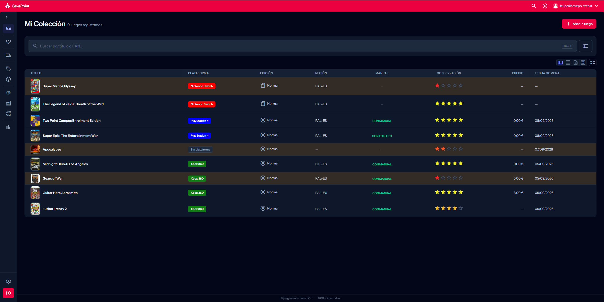
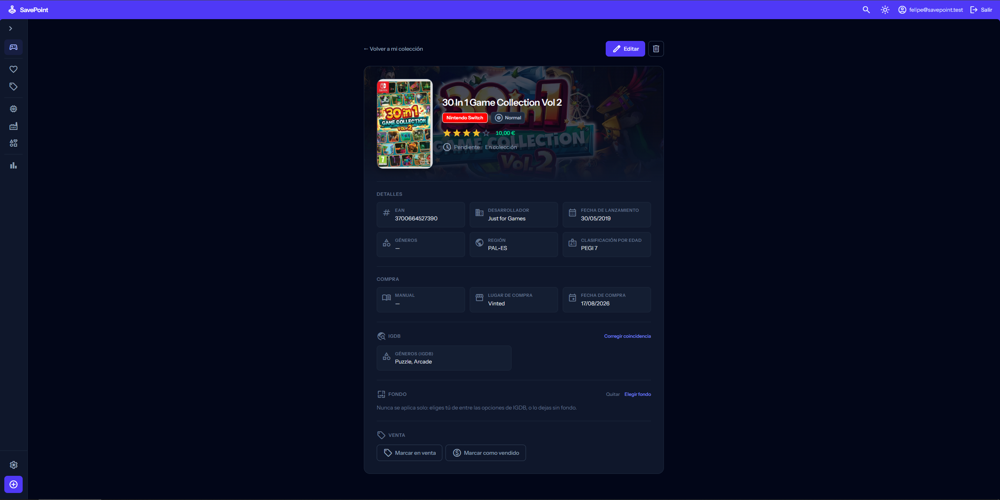
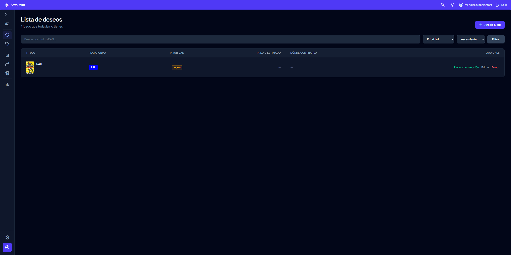
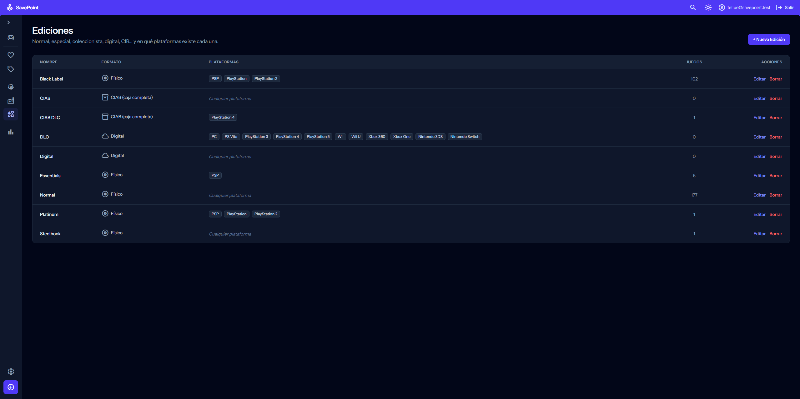
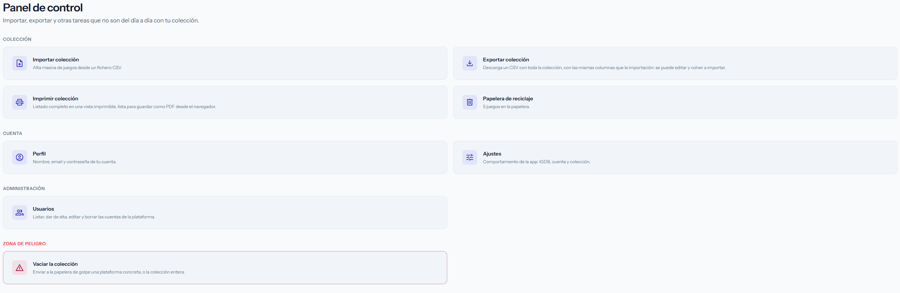
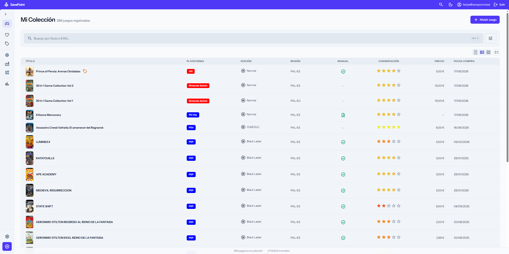
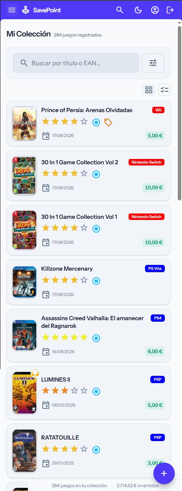

<div align="center">


# Savepoint

**Tu colección de videojuegos, catalogada de verdad — y solo tuya.**

[](LICENSE)


</div>

Se acabó llevar la colección en una hoja de cálculo. Savepoint cataloga cada juego con su carátula, desarrollador, fecha
de lanzamiento y nota reales (autocompletados desde IGDB y CEX, no tecleados a mano), deja escanear el código de barras
con la cámara del móvil, sigue cuánto te ha costado y cuánto has sacado al vender, y lo enseña todo en estadísticas de
verdad — plataformas, gasto por mes, géneros favoritos, rendimiento de ventas.

Es 100% autoalojada: se despliega con un `docker compose up` en tu propio servidor o NAS, guarda los datos en tu
Postgres, no en la nube de nadie, y no depende de ninguna clave de API que no sea la tuya (cada cuenta usa las suyas
propias con IGDB, opcionalmente). Backend Laravel que sirve tanto la interfaz web (Blade + Tailwind) como una API REST
(Sanctum) lista para un futuro cliente externo, como una app móvil.

Historial de cambios en [`CHANGELOG.md`](CHANGELOG.md).

## Lo más destacado

- **Alta con datos reales, no a pelo**: busca la carátula y el EAN en CEX, y completa desarrollador/fecha/géneros/nota
  desde IGDB — con tus propias credenciales, gratuitas, ni una llamada más de las necesarias.
- **Escaneo de código de barras** con la cámara del móvil, e instalable como PWA para abrirla como una app aparte.
- **Importación/exportación masiva por CSV**, con vista previa de lo que se va a crear antes de confirmar nada.
- **Estadísticas de la colección**: gasto total y por mes, reparto por plataforma/estado/década, top de géneros,
  destacados y rendimiento de ventas.
- **Lista de deseos** independiente y **seguimiento de ventas** con beneficio real por juego y por año.
- **Multiusuario con roles** y registro público, con aislamiento total de datos por cuenta — cada cuenta ve solo lo suyo.
- **Tuya de verdad**: autoalojada con Docker, tus datos en tu propio Postgres, sin límites ni suscripción.

## Capturas

<table>
<tr>
<td width="50%">

<br><sub><b>Mi Colección</b>: listado con miniatura, plataforma, edición, región, manual, conservación, precio y fecha de compra.</sub>
</td>
<td width="50%">

<br><sub><b>Ficha de detalle</b>: géneros y fondo con arte promocional traídos de IGDB automáticamente.</sub>
</td>
</tr>
<tr>
<td width="50%">

<br><sub><b>Lista de deseos</b>: los juegos que todavía no tienes, aparte de la colección y de sus totales.</sub>
</td>
<td width="50%">

<br><sub><b>Ediciones</b>: Normal, Black Label, CIAB... y en qué plataformas existe cada una.</sub>
</td>
</tr>
<tr>
<td width="50%">

<br><sub><b>Panel de control</b>: importar/exportar, papelera, perfil, ajustes y gestión de usuarios.</sub>
</td>
<td width="50%">

<br><sub><b>Tema claro</b>, junto al oscuro — ajuste de cuenta, te sigue a cualquier dispositivo.</sub>
</td>
</tr>
</table>

<p align="center">

<br><sub><b>Vista móvil</b>: la colección como tarjetas, con edición/borrado siempre desde la ficha de detalle.</sub>
</p>

## Índice

- [Lo más destacado](#lo-más-destacado)
- [Características](#características)
- [Stack técnico](#stack-técnico)
- [Desplegar para uso propio](#desplegar-para-uso-propio)
- [Tests](#tests)
- [Pendiente / en curso](#pendiente--en-curso)
- [Ideas a futuro](#ideas-a-futuro)
- [Contribuir](#contribuir)
- [Licencia](#licencia)

## Características

### Gestión de la colección de juegos

- Alta de un juego mediante un único formulario directo, sin pasos intermedios. Cubre prácticamente todo el modelo:
  título, EAN, desarrollador, plataforma, fecha de lanzamiento, géneros, propiedad (en colección/lista de
  deseos/vendido), estado de juego, conservación, precio y lugar/fecha de compra, manual, región, clasificación por edad
  y notas.
- **Carátula**: se sube desde el propio formulario (JPG/PNG/WEBP, máx. 1MB) con vista previa en vivo que respeta la
  proporción real de la imagen, sin recortarla. Si el juego no tiene carátula, se muestran las iniciales del título en
  su lugar.
- Listado de la colección con miniatura, título, plataforma, edición, región, manual, conservación (estrellas), precio y
  fecha de compra, paginado. En móvil se muestra como tarjetas en vez de tabla; tocar cualquier punto de una tarjeta
  abre la ficha de detalle del juego, que es el único sitio desde el que se edita o se borra.
- La colección se busca por **título**/ **EAN** desde el mismo buscador rápido de toda la app (`Ctrl+K`, ver Interfaz):
  ya no hay un buscador de texto aparte en la propia página, solo un botón con su misma pinta que lo abre, precargado
  con la búsqueda activa si la hay. Un icono "Avanzado" en la página sigue desplegando los filtros de **plataforma**,
  **estado de juego**, **propiedad**, orden y tamaño de página, que gobiernan el listado paginado (el buscador rápido no
  pagina).
- **Ficha de detalle de solo lectura** con toda la información del juego, para "solo mirar" sin abrir el formulario de
  edición.
- **Enriquecimiento automático con IGDB**: la primera vez que se abre la ficha de un juego, se busca en IGDB por título
  (acotado por plataforma si hay match) y se completan desarrollador/fecha de lanzamiento si estaban vacíos, más géneros
  (en inglés, aparte de los que se escriben a mano) y la nota agregada — sin ninguna acción del usuario, y en segundo
  plano (worker de cola): la ficha se sirve sin esperar a IGDB, el resultado se ve al volver a abrirla. Un botón
  "Corregir coincidencia" permite buscar y elegir otro resultado a mano si el automático no es el correcto (remaster,
  plataforma equivocada...). Requiere credenciales de IGDB (ver `IGDB_CLIENT_ID`/`IGDB_CLIENT_SECRET` en
  `.env.example`); sin ellas, este enriquecimiento simplemente no ocurre.
- **Fondo de la ficha con arte de IGDB**: botón "Elegir fondo" que muestra una muestra del arte promocional disponible
  en IGDB para elegir uno (o ninguno) como cabecera de la ficha del juego. Con el ajuste "Fondo automático desde IGDB"
  (ver Panel de control) activado, el primer arte disponible se fija solo al dar de alta el juego; desactivado (por
  defecto), sigue siendo siempre una elección explícita.
- La conservación se muestra como estrellas de solo lectura en cualquier vista del listado (tarjetas, tabla,
  estantería): se cambia siempre desde la ficha de edición del juego, nunca tocando directamente sobre el listado.
- Edición de un juego existente, incluida la opción de reemplazar o quitar la carátula.
- Al dar de alta o editar un juego con un EAN que ya tienes registrado, se avisa antes de guardar en vez de duplicarlo
  sin más (con opción de "guardar de todos modos" para el caso legítimo de tener dos copias físicas).
- Baja de un juego mediante **papelera de reciclaje**: panel dedicado para ver los juegos borrados, restaurarlos o
  eliminarlos definitivamente. El aviso de borrado lleva un botón "Deshacer" que restaura el juego sin salir de la
  colección.
- **Importación masiva** desde un CSV: solo el título es obligatorio, cada fila se procesa de forma independiente (una
  fila con error no bloquea al resto) y las plataformas/ediciones que el CSV mencione y no existan todavía en el
  catálogo se crean automáticamente. Antes de importar se muestra una vista previa de lo que se va a crear, con una
  plantilla de ejemplo descargable. El CSV se procesa en segundo plano (worker de cola), así que ficheros grandes no
  bloquean el formulario: en cuanto se sube, la página pasa a sondear el resultado y lo muestra en cuanto termina.
- **Buscar carátula y EAN en CEX** (webuy.com) desde el propio formulario de alta o edición: busca por EAN o título en
  su catálogo, muestra los resultados con carátula/EAN/plataforma para elegir con confianza, y rellena ambos campos al
  elegir uno. En el alta busca por lo que ya se haya tecleado en EAN/título antes de pulsar el botón (el juego todavía
  no está guardado); en la edición, por defecto usa el EAN/título ya guardados. Si la búsqueda automática no encuentra
  nada, se puede repetir a mano con otras palabras.
- Panel de gestión de ediciones (normal/especial/coleccionista...) asociadas a una o varias plataformas — o a ninguna,
  lo que la deja disponible para cualquier plataforma, presente o futura. Una edición **"Normal"** con ese criterio
  viene creada de fábrica y es la que se preselecciona por defecto al dar de alta un juego (configurable desde Ajustes,
  junto con la región por defecto). Si la edición que necesitas no existe todavía, se puede crear al vuelo desde el
  propio formulario de alta/edición de juego sin perder lo ya rellenado. Cada edición tiene además un **formato**
  (físico/digital/CIAB, físico por defecto) marcado con icono en la gestión de ediciones, la ficha del juego y el
  listado de la colección.
- **Marcar un juego como "en venta"**: etiqueta independiente del estado de Propiedad (un juego sigue en tu colección y
  además puede estar en venta), con badge en las tres vistas de la colección (tarjetas, tabla, estantería) y su propio
  filtro. Se activa desde la ficha de detalle del juego o desde el propio formulario de alta/edición. Tiene además su
  propia página, **En venta** (`/for-sale`, enlazada desde el sidebar junto a Ventas), pensada para dar mantenimiento a
  esos juegos (quitarlos de venta, marcarlos como vendidos) sin mezclarlos con el resto — un ajuste en Ajustes permite
  además ocultarlos del listado de la colección sin filtrar (ver Panel de control).
- **Vender un juego**: desde su ficha de detalle, un botón "Marcar como vendido" pide precio y fecha de venta (y permite
  ajustar las notas) y envía el juego a la papelera — deja de aparecer en tu colección, pero recuperable como cualquier
  borrado. Una página aparte, **Ventas** (`/sales`), reúne el histórico agrupado por año (título, plataforma, edición,
  región, precio de compra/venta, rendimiento, notas), con opción de deshacer una venta y que el juego vuelva a la
  colección.

### Lista de deseos

- Página propia para los juegos que todavía no tienes: **nunca aparecen en la colección principal** ni cuentan en sus
  totales.
- **Alta reducida**: a diferencia del alta normal, solo pide título, plataforma y edición — el resto de campos (precio,
  conservación, manual...) no tienen sentido todavía.
- Cada juego admite **prioridad** (alta/media/baja), **precio estimado** y **dónde comprarlo**. Buscador por título/EAN
  y orden por prioridad, título o precio estimado.
- Acción **"Pasar a la colección"**: abre el formulario de edición completo con los datos ya insertados y
  Propiedad/fecha de compra preseleccionadas, para no tener que rellenar todo de nuevo cuando por fin compras un juego
  de tu lista.

### Encargos

- Página propia (`/commissions`) para la logística de juegos que compran/envían amigos, o que tú compras/envías a
  alguien — un concepto aparte de "En venta"/"Ventas" (eso es vender lo tuyo, esto es recibir o enviar a través de otra
  persona) y de la colección (no cuentan en ella hasta que llegan de verdad).
- Cada encargo guarda título, plataforma, **a quién**, **dirección** ("Me lo deben" / "Se lo debo"), precio y fecha de
  compra. CRUD completo (editar/borrar) por si hay que corregir algo.
- **Marcar como recibido** (dirección "Me lo deben"): dado de alta un `Game` de verdad en tu colección (estado "En
  colección", pendiente de jugar) y te lleva directo a su edición para completar lo que el encargo no recoge (EAN,
  condición, manual, notas...).
- **Marcar como enviado** (dirección "Se lo debo"): solo anota la fecha, nunca crea un juego en tu colección — el juego
  se va, no se queda.
- El encargo **nunca desaparece ni se borra al resolverse**: se queda listado como histórico, con enlace directo a la
  ficha del juego cuando se creó uno, para poder consultar más adelante qué se envió o recibió y cuándo.

### Catálogo (fabricantes y plataformas)

- Panel de gestión para dar de alta, editar y borrar tus propios fabricantes y plataformas, en vez de depender de un
  catálogo precargado fijo.
- Cada **fabricante** define un color de marca para su chip que heredan todas sus plataformas; cada **plataforma** puede
  personalizar el suyo y tiene una **etiqueta abreviada** editable (p. ej. "PS5").

### Autenticación

- **Web:** login/logout con sesión (regenera el ID de sesión al iniciar sesión para evitar session fixation; redirige a
  la página original tras el login).
- **API:** login/logout con emisión y revocación de token Sanctum, pensado para un cliente externo (app móvil).
- **Perfil** (`/profile`): el usuario puede actualizar su nombre/email, subir/cambiar/quitar su **avatar** (JPG/PNG/GIF/
  WEBP, máx. 2MB, con vista previa antes de guardar — sin avatar se muestra un icono genérico en su lugar) y cambiar su
  contraseña (pide la contraseña actual para confirmarla).
- **Recuperación de contraseña** (`/forgot-password`, `/reset-password/{token}`): flujo estándar de Laravel (token de un
  solo uso, expira a los 60 minutos, mismo mensaje de éxito exista o no el email para no revelar qué cuentas están
  registradas). El email se envía por el canal configurado en `MAIL_MAILER` (`log` por defecto en desarrollo, así que el
  enlace aparece en `storage/logs/laravel.log`).
- **Registro público** (`/register`, activable/desactivable por un admin — ver Gestión de usuarios): nombre, email único
  y contraseña (mínimo 8 caracteres, con mayúscula, minúscula, número y símbolo) con confirmación; la cuenta creada
  nunca es admin. Limitado a 5 intentos por minuto y por IP para evitar abuso, aparte del límite que ya protege el
  login.
- **2FA por email**: toda cuenta nueva lo lleva activo desde el momento del registro (sin elección en el formulario:
  tras crear la cuenta, antes de dar acceso, pide un código de 6 dígitos enviado por email, válido 10 minutos y de un
  solo uso) — se puede desactivar después desde Ajustes una vez dentro, mismo patrón por cuenta que las credenciales
  de IGDB. Las cuentas ya existentes antes de esta función lo llevan desactivado y lo activan igual desde Ajustes si
  quieren. Con "recordar este dispositivo" marcado en el propio desafío, no se repite en el mismo navegador durante
  30 días. Reenvío de código y verificación limitados aparte (5 intentos/10 min y 3 reenvíos/5 min) para que no se
  pueda tantear por fuerza bruta.
- **Gestión de usuarios** (`/panel/users`, solo cuentas con el rol **admin**): listar todas las cuentas de la plataforma
  con su nº de juegos, dar de alta cuentas nuevas (nombre/email/contraseña puesta a mano, rol admin opcional), editarlas
  y borrarlas. Un admin no puede quitarse el rol a sí mismo ni borrar su propia cuenta, y no se puede borrar una cuenta
  que todavía tenga juegos (evita el borrado en cascada real de toda su colección a nivel de base de datos). No hay
  ningún admin por defecto "de fábrica": la migración que añadió el rol marcó como admin a todas las cuentas que ya
  existían en ese momento.
  - **Abrir o cerrar el registro público** desde la misma página: un interruptor decide si `/register` está disponible
    para cualquiera o si las cuentas solo se pueden crear desde aquí. Primer ajuste de instancia de la app (no de
    cuenta): vive en su propia tabla (`app_settings`, una sola fila), separado de todo lo que cuelga de un usuario.

### API REST

- CRUD de juegos (`GET/POST/PUT/DELETE /api/games`) protegido con `auth:sanctum`.
- El listado (`index`) pagina: 20 juegos por página por defecto, admite `?per_page=` con tope de 100. Admite los mismos
  filtros que el listado web: `?q=` (título o EAN), `?platform_id=`, `?play_status=` y `?status=`.
- Respuestas transformadas con `GameResource` (aplana la plataforma a su nombre, expone URL de carátula, etc.).
- Validación de entrada separada en `StoreGameRequest` / `UpdateGameRequest`.
- Tokens Sanctum con expiración global de 30 días desde su emisión (`SANCTUM_TOKEN_EXPIRATION_MINUTES` en `.env`,
  `config/sanctum.php`): pasado ese tiempo dejan de autenticar aunque no se hayan revocado a mano, así que un token
  filtrado no queda válido para siempre.

### Estadísticas

- Panel (`/stats`) con total de juegos, gasto total y conservación media, reparto de juegos por plataforma (barra por
  plataforma), y reparto por estado de juego y por propiedad (barras apiladas con leyenda).
- Evolución del gasto por mes de compra (gráfico de barras, últimos 12 meses con datos), top de géneros más repetidos en
  la colección, reparto por década de lanzamiento (`release_date`, orden cronológico) y destacados (juego más caro y
  mejor valorado, con enlace a su ficha).
- **Ventas por año**: nº de ventas, invertido, obtenido y rendimiento (beneficio y %) de los juegos vendidos, con enlace
  al histórico completo en `/sales`.

### Exportación

- **A CSV**: descarga toda la colección (respeta los filtros activos del listado) con las mismas columnas que reconoce
  la importación, así que el fichero se puede editar y volver a importar tal cual.
- **Imprimible / PDF**: vista independiente con la colección completa, lista para guardar como PDF desde el propio
  diálogo de impresión del navegador — sin generar nada en el servidor.

### Panel de control

- Página (`/panel`, enlazada desde el sidebar) que agrupa tareas que no son del día a día con la colección:
  importar/exportar, la papelera de reciclaje (con el nº de juegos que contiene), el perfil del usuario y los ajustes de
  comportamiento (ver debajo). Sustituye a los iconos "Importar" y "Papelera" que antes vivían sueltos en el sidebar
  (siguen accesibles por URL directa, y el icono del panel se resalta como activo también en esas páginas).
- **Ajustes** (`/panel/settings`): comportamiento de la app configurable por cuenta, no de instancia (esta app no tiene
  concepto de administrador global).
    - **IGDB**: activar la búsqueda en IGDB (desarrollador, fecha de lanzamiento, géneros, nota y fondos) requiere darse
      de alta como desarrollador en Twitch (gratis, https://dev.twitch.tv/console/apps) e introducir el Client ID y
      Client Secret propios — son credenciales por cuenta, no de instancia, así que quien se despliegue esta app no
      depende de las de nadie más. Desactivado por defecto; sin credenciales válidas, la app nunca hace ninguna petición
      a IGDB.
    - **Fondo automático desde IGDB**: requiere IGDB activado arriba. Si está activo, al dar de alta un juego se intenta
      identificar en IGDB y, si tiene arte disponible, se fija el primero como fondo de la ficha sin ninguna acción del
      usuario — se puede seguir cambiando a mano entre el resto de opciones, igual que siempre. Desactivado, el fondo se
      queda vacío hasta elegirlo a mano, como hasta ahora. Desactivado por defecto.
    - **Orden y tamaño de página por defecto** con los que arranca el listado de la colección, y **región y edición por
      defecto** que se preseleccionan al dar de alta un juego: un filtro o una elección explícita en el momento siguen
      ganando siempre a estos valores por defecto.
    - **Excluir la lista de deseos** de los resultados del buscador rápido (Ctrl+K), para quien prefiera no verla
      mezclada con la colección ahí (incluida por defecto, como hasta ahora).
    - **Ocultar los juegos en venta** del listado de la colección sin filtrar: siguen viéndose con el filtro "En venta"
      y en su propia página (`/for-sale`), pero desaparecen del listado por defecto. Incluidos por defecto, como hasta
      ahora.
    - Tema claro/oscuro y la vista de la colección elegida (ver Interfaz) también se guardan aquí, aunque se cambian
      desde sus propios controles (icono del header, botones de vista), no desde este formulario.

### Seguridad de datos

- Cada juego pertenece a un usuario (`user_id`), asignado siempre al usuario autenticado (`auth()->id()` /
  `$request->user()->id`) al crearlo, tanto en web como en API.
- Listados y búsqueda (web y API) filtrados por `user_id`: cada usuario solo ve su propia colección.
- `GamePolicy` aplicada con `Gate::authorize()` en editar, borrar, restaurar y eliminar definitivamente (web y API),
  para que nadie pueda tocar un juego ajeno aunque adivine su ID por URL.
- Login (web y API) con protección contra fuerza bruta: bloqueo de 60 segundos tras 5 intentos fallidos, con clave
  email+IP (`ThrottlesLogins`), así que un atacante no puede bloquear a otros usuarios que compartan su misma IP.
  Además, un segundo límite más laxo (10 intentos / 5 minutos) solo por email frena a quien rota de IP en cada intento
  para saltarse el primero.
- Botón de cerrar sesión ("Salir") en la navegación.

### Interfaz

- Sidebar plegable a solo iconos en escritorio, y drawer deslizante con botón hamburguesa en móvil.
- La colección se ve como tarjetas en móvil y como tabla en escritorio, con edición/borrado siempre desde la ficha de
  detalle del juego, nunca con iconos sueltos en cada fila.
- Feedback de acciones consistente en toda la app: toasts flotantes para confirmaciones (con "Deshacer" cuando aplica) y
  un diálogo propio para confirmar acciones destructivas, en vez del `confirm()` nativo del navegador.
- Tema claro/oscuro y vista de la colección (línea de abajo) son ajustes de **cuenta**, no solo del navegador (antes
  vivían solo en `localStorage`): se pintan server-side desde el primer HTML, sin parpadeo al cargar o navegar, y te
  siguen a cualquier dispositivo donde inicies sesión.
- Orden del listado por título, precio, conservación o fecha de compra (con un valor por defecto configurable desde
  Ajustes); atajo de teclado `/` abre el buscador rápido, igual que `Ctrl+K`.
- Acciones en bloque: seleccionar varios juegos a la vez para enviarlos a la papelera o cambiarles el estado de golpe.
- Botón flotante de "Añadir juego" en móvil, para no tener que volver arriba al hacer scroll por una colección larga.
- Tres formas de ver la colección: la habitual, una tabla compacta y una estantería de carátulas grandes, con un fundido
  suave al cambiar entre ellas en vez del salto instantáneo de antes.
- Barra de estado discreta con el total de juegos y el gasto invertido en toda la colección, siempre visible.
- **Insignia de "completado"** (icono de trofeo): los juegos con estado de juego = terminado la llevan en la esquina de
  la carátula, tanto en la vista de estantería como en la miniatura de la tarjeta (móvil).
- **Buscador único de la app** (`Ctrl+K`/`Cmd+K`, también la tecla `/` y el botón-buscador de la propia colección):
  resultados en vivo por título o EAN mientras se escribe (con un esqueleto de carga mientras llegan, en vez de dejar
  los resultados anteriores congelados), con filtros opcionales de plataforma/estado de juego/propiedad y un enlace para
  ver todos los resultados en la colección paginada cuando hace falta más que eso. Si el juego no está en tu colección,
  se ofrecen además **sugerencias de CEX** (webuy.com) con EAN y carátula reales para rellenar el alta con un clic; la
  lista de deseos se puede excluir de estos resultados desde Ajustes.
- **Escaneo de código de barras** con la cámara desde la propia búsqueda rápida: detecta el EAN y lo vuelca en el
  buscador, enlazando con las sugerencias de CEX si el juego todavía no está en tu colección. Necesita HTTPS para
  acceder a la cámara fuera de `localhost` (ver [Desplegar para uso propio](#desplegar-para-uso-propio)).
- **Instalable como PWA**: manifest (`public/manifest.json`) y service worker (`public/sw.js`, cache-first solo para los
  assets versionados de Vite) para poder "añadir a pantalla de inicio" en móvil y abrirla como app aparte. Igual que el
  escaneo de código de barras, el service worker solo se registra en HTTPS o `localhost`.

## Stack técnico

- **Backend:** Laravel 13 / PHP 8.3
- **Base de datos:** PostgreSQL (usa `JSONB` para campos como `genres`)
- **Autenticación web:** sesiones con guard `web` (login por email/contraseña)
- **Autenticación API:** Laravel Sanctum (tokens Bearer)
- **Frontend web:** Blade + Tailwind CSS + Vite.
- **Localización:** interfaz y mensajes de validación en español (`APP_LOCALE=es`, `lang/es/`). Laravel 11+ no publica
  estos archivos por defecto; se generaron y tradujeron a mano para que los errores de formulario no muestren la clave
  sin traducir (p. ej. `validation.required`).

## Desplegar para uso propio

### Arranque rápido con Docker

Todo lo que hace falta es Docker y Docker Compose. El stack (`docker-compose.yml`) levanta cinco contenedores:
`postgres`, `redis`, `app` (PHP-FPM), `queue` (worker de Redis) y `nginx`. La inicialización de la app (instalación de
dependencias, generación de `APP_KEY`, migraciones, seeders y compilación de assets) es 100% automatizada vía entrypoint
en el arranque:

```bash
git clone <url-del-repo> savepoint && cd savepoint
cp .env.example .env   # valores por defecto ya funcionan sin tocar nada; ver "Personalizar puertos y credenciales"

docker compose up -d --build
```

La app queda disponible en **`http://localhost:8081`** con el usuario inicial `admin@savepoint.test` y contraseña
`password`.

Tras cualquier cambio en las vistas Blade o código PHP basta con recargar el navegador (no hay paso de build gracias al
volumen). Tras un cambio en CSS/JS (`resources/css`, `resources/js`), se puede recompilar con
`docker compose exec app npm run build`.

### Personalizar puertos y credenciales

Por defecto todo funciona con los valores de `.env.example` (contraseña `secreto123`, puertos 5432/6379/8081/8043). Si
algún puerto ya lo tienes ocupado, o vas a hacer un despliegue real y quieres cambiar la contraseña de Postgres, copia
`.env.example` a `.env` en la raíz del proyecto (si no lo has hecho ya) y edita lo que necesites — es el **único**
`.env` del proyecto: el mismo fichero que lee Docker Compose para las credenciales de Postgres/Redis y los puertos es,
directamente, el que carga Laravel. Tras cambiarlo, `docker compose up -d --build` para que se aplique.

### Exponer la app fuera de `localhost`

Por defecto la app sirve por HTTP plano en el puerto 8081, sin TLS — de sobra para usarla en `localhost` o dentro de tu
propia red local desde un ordenador. Para acceder desde el móvil hace falta además HTTPS: el escaneo de código de barras
usa la cámara del navegador (`getUserMedia`), que solo se permite en "contextos seguros" (HTTPS, o `localhost`). nginx
en sí no gestiona certificados — sirve siempre HTTP plano; el TLS lo pone un **proxy inverso** delante:

- **Cloudflare Tunnel** o **Tailscale Funnel**: HTTPS gratuito sin tocar la configuración de nginx; cómodo para acceder
  desde fuera de tu red local.
- **mkcert + nginx**: certificado local de confianza, si el acceso es solo dentro de tu LAN.
- **Caddy** como reverse proxy delante de nginx: certificados Let's Encrypt automáticos si tienes un dominio propio.

En `docker-compose.yml`, el servicio `nginx` publica su puerto con dos líneas alternativas (una comentada): la de
desarrollo/testeo (`HTTP_PORT`, 8081 por defecto) y la de producción (`HTTPS_PORT`, 8443 por defecto — el puerto al que
apunta tu proxy inverso, que sigue hablando HTTP normal con nginx por detrás). Comenta una y descomenta la otra según
toque, y `docker compose up -d --build` para que se aplique.

La cookie de sesión no necesita ningún ajuste aparte para llevar el flag `Secure` en este escenario: `bootstrap/app.php`
confía en las cabeceras `X-Forwarded-*` de cualquier origen (`trustProxies(at: '*')`, seguro aquí porque el proxy
inverso es el único punto de entrada), así que en cuanto este manda `X-Forwarded-Proto: https`, Laravel detecta la
petición como segura y marca la cookie sola — sin tocar `SESSION_SECURE_COOKIE` en `.env` (se deja sin definir a
propósito, ver comentario en `.env.example`).

Para un despliegue "en serio" en un servidor, además de lo anterior:

- Ajusta en tu `.env` `APP_ENV=production`, `APP_DEBUG=false` y `APP_URL` con el dominio final.
- Cambia `DB_PASSWORD` por una contraseña real (`openssl rand -base64 24`, por ejemplo) — la de `.env.example` es solo
  para desarrollo local. Esto **solo tiene efecto en un volumen de Postgres nuevo**: si vas a reutilizar un volumen que
  ya tenía otra contraseña, Postgres la guarda en sus propios datos y no se actualiza sola al cambiar el `.env`. Para
  que coincidan, cambia también la contraseña real:
  `docker compose exec postgres psql -U savepoint -d savepoint -c "ALTER USER savepoint WITH PASSWORD 'nueva_contraseña';"`.

⚠️ Para aplicar migraciones nuevas usa siempre `php artisan migrate`, **nunca `migrate:fresh`** en un entorno con datos
reales: `migrate:fresh` hace `DROP` de todas las tablas antes de recrearlas. `migrate` a secas solo aplica lo pendiente
y no borra nada — el resultado en una base de datos vacía es el mismo que `fresh` de todas formas, así que no hay
ninguna razón para usar `fresh` salvo que quieras borrarlo todo a propósito. Esto ya causó una pérdida de datos real
durante el desarrollo del proyecto (ver CHANGELOG del 2026-08-06).

## Tests

```bash
docker compose exec app php artisan test
```

El entorno de test es independiente del de desarrollo: `phpunit.xml` fuerza `APP_ENV=testing`, SQLite en memoria,
sesión/caché en array, etc., así que correr los tests nunca toca la base Postgres real ni Redis.

Cobertura actual:

- `Tests\Feature\Auth\WebAuthTest`: login/logout, credenciales inválidas, redirect a la página originalmente solicitada,
  protección de rutas para invitados, bloqueo por fuerza bruta (por email+IP y, rotando de IP en cada intento, por el
  límite adicional solo por email), y que el enlace "Regístrate" aparece o no según el registro público esté abierto o
  cerrado.
- `Tests\Feature\Auth\RegisterTest`: alta con datos válidos (evento `Registered`, contraseña hasheada, cuenta creada
  con 2FA activo y sin autenticar todavía), que completar el desafío de 2FA es lo que autentica de verdad y respeta la
  página originalmente solicitada, validación (nombre obligatorio, email válido y único, contraseña con mínimo 8
  caracteres y mayúscula/minúscula/número/símbolo, confirmación), que no se puede escalar a admin desde el formulario,
  invitado vs. usuario ya autenticado, límite de 5 registros/minuto por IP, que el 2FA se puede desactivar después
  desde Ajustes, el enlace desde el login, que el formulario y el propio endpoint quedan bloqueados (con redirect a
  `/login` y aviso) cuando un admin cierra el registro público, que un fallo al enviar el código de 2FA deshace el
  registro en vez de dejar una cuenta huérfana, y que el formulario desactiva el autorrelleno de cuentas guardadas y
  muestra los requisitos de la contraseña.
- `Tests\Feature\Auth\TwoFactorTest`: login con 2FA desactivado sin cambios, login con 2FA activo redirige al desafío
  en vez de autenticar, código correcto/incorrecto/caducado, límites de verificación y reenvío, que reenviar invalida
  el código anterior, "recordar dispositivo" crea la cookie/fila y un login posterior con ella se salta el desafío
  (uno con una cookie desconocida sigue pidiéndolo), el email censurado que muestra la pantalla del desafío, y de
  seguridad: que la cookie de dispositivo de confianza de una cuenta no sirve para saltarse el desafío de otra, y que
  un `user_id` colado a mano en el body de `two-factor.verify` no tiene ningún efecto (siempre sale de la sesión); y
  que un fallo al enviar el código (login o reenvío) muestra un aviso claro en vez de un 500 sin manejar.
- `Tests\Feature\Api\AuthTest`: login/logout vía Sanctum (emisión y revocación de token), `/api/user` protegido, bloqueo
  por fuerza bruta, expiración de token (rechazado pasado el límite configurado, aceptado justo antes).
- `Tests\Feature\SessionCookieSecurityTest`: la cookie de sesión no lleva `Secure` por HTTP plano, pero sí en cuanto la
  petición llega con `X-Forwarded-Proto: https` (simula el proxy inverso de producción).
- `Tests\Feature\Api\GameControllerTest`: CRUD completo de la API, paginación (tamaño por defecto, `per_page` a medida y
  con tope), filtros (`q`, `platform_id`, `play_status`, `status`), scoping por usuario y `GamePolicy` bloqueando acceso
  a juegos ajenos (403 en view/update/delete).
- `Tests\Feature\Web\GameControllerTest`: alta y edición de juegos con subida/reemplazo de carátula real, validación,
  aviso de EAN duplicado (con y sin confirmar), `GamePolicy` aplicada en las rutas web, la ficha de detalle, la edición
  rápida (estado/en venta) por AJAX y por formulario normal, el filtro "en venta", el fragmento que devuelve `index()`
  para peticiones AJAX, el orden/paginación/región/edición por defecto de Ajustes (aplicados solo cuando la URL o el
  formulario no traen un valor explícito), y el autoasignado de fondo desde IGDB al dar de alta con ese ajuste activo.
- `Tests\Feature\Web\GameExportControllerTest`: exportación imprimible/PDF y a CSV, mismos filtros que el listado,
  scoping por usuario, y de regresión, que la vista imprimible es un documento autocontenido sin el layout de la app.
- `Tests\Feature\Web\GameTrashControllerTest`: papelera (listar/restaurar/eliminar definitivamente, buscador/filtro
  propio, con scoping por usuario) y que excluye los juegos vendidos.
- `Tests\Feature\Web\GameBulkActionControllerTest`: acciones en bloque (borrar, cambiar estado de juego) acotadas al
  usuario autenticado, con validación de los IDs seleccionados.
- `Tests\Feature\Web\GameCoverLookupControllerTest`: búsqueda de carátula/EAN en CEX tanto para un juego ya guardado
  (por su EAN o su título, o por una búsqueda manual) como para el alta (sin resultados ni llamada a CEX sin `q`,
  requiere sesión iniciada).
- `Tests\Feature\Web\GameImportControllerTest`: importación desde CSV (con/sin BOM, separador coma o punto y coma),
  creación automática de plataformas/ediciones que no existían, filas sin título omitidas y reportadas como incidencia,
  validación del fichero subido, y la vista previa (columnas reconocidas/no reconocidas, filas de ejemplo, que no
  importa nada).
- `Tests\Feature\Web\ManufacturerControllerTest` / `PlatformControllerTest` / `EditionControllerTest`: CRUD de cada
  panel de catálogo, validaciones propias (colores en formato hex, nombre único de fabricante, colores obligatorios solo
  si se sobrescriben en una plataforma), que borrar un registro deja en `null` la relación en juegos/plataformas en vez
  de arrastrar el borrado, que la edición "Normal" existe por defecto sin ninguna plataforma asociada (disponible para
  cualquiera), y el formato de edición (físico por defecto si no se indica, alta/edición con un formato concreto,
  formato inválido rechazado).
- `Tests\Feature\Web\SearchControllerTest`: búsqueda rápida por título/EAN acotada al usuario autenticado, filtros de
  plataforma/estado de juego/propiedad, sugerencias externas de CEX solo cuando no hay coincidencia local (y no antes de
  3 caracteres), y que la lista de deseos aparece o no según el ajuste correspondiente.
- `Tests\Feature\Web\PanelControllerTest`: enlaces del panel y contador de la papelera por usuario, y la página de
  Ajustes — guardar cada grupo de preferencias (incluido dejar un valor en blanco para volver al comportamiento por
  defecto), que no afectan a otros usuarios, y el endpoint AJAX de tema/vista de la colección.
- `Tests\Feature\Web\ProfileControllerTest`: actualización de nombre/email (con email único), subida/reemplazo/
  eliminación de avatar (con limpieza del fichero anterior en disco), validación del avatar (tipo/tamaño), y cambio de
  contraseña exigiendo la actual y confirmación.
- `Tests\Feature\Web\UserControllerTest`: invitados y usuarios no-admin bloqueados (redirect/403) en todas las rutas de
  gestión de usuarios, listado con nº de juegos por cuenta, alta con contraseña hasheada, validación (email único,
  contraseña mínima y confirmada), edición de nombre/email/rol, cambio de contraseña opcional (en blanco no la toca),
  que un admin no puede quitarse el rol ni borrarse a sí mismo, que no se puede borrar una cuenta con juegos, que el
  registro público está abierto por defecto, y que un admin puede cerrarlo/reabrirlo.
- `Tests\Feature\Web\StatsControllerTest`: los totales y repartos (por plataforma, estado de juego, propiedad, gasto por
  mes, top de géneros, destacados y ventas por año) solo consideran los juegos del usuario autenticado.
- `Tests\Feature\Web\SalesControllerTest`: histórico de ventas agrupado por año con sus totales/rendimiento, scoping por
  usuario, deshacer una venta (el juego vuelve a la colección sin datos de venta) y `GamePolicy` bloqueando la
  restauración de una venta ajena, marcar un juego como vendido (validación, envío a la papelera, `GamePolicy`).
- `Tests\Feature\Web\PasswordResetTest`: envío del enlace de reset (mismo mensaje exista o no el email), reset con token
  válido/inválido.
- `Tests\Unit\Models\GameTest` / `PlatformTest`: iniciales y URL de carátula, resolución de colores/etiqueta de chip con
  fallback a fabricante.

## Pendiente / en curso

Agrupado por la sección de la app a la que afecta cada pendiente.

### API REST

- **Documentar la API REST**: hoy la única "documentación" es leer `routes/api.php`/los controladores. Por endpoint (`/api/login`, `/api/logout`, `/api/user`, `/api/games` CRUD): qué recibe (cada campo del payload con su tipo y si es obligatorio/opcional — ver `StoreGameRequest`/`UpdateGameRequest` para las reglas ya validadas) y qué devuelve (forma del JSON de `GameResource`, paginación de `index()`, códigos de estado de error). Formato ligero (un `docs/api.md` a mano), no una herramienta tipo L5-Swagger/Scribe — de sobra para dos controladores.

### Gestión de la colección

- **Filtro de plataforma: opción "Sin plataforma"** para los juegos con `platform_id` nulo — hoy el desplegable de plataformas (`games/_filters.blade.php`) solo lista plataformas reales, no hay forma de aislar los que no tienen ninguna asignada.
- **Alta de un juego: quitar la sección "Lista de deseos" del formulario completo** (`games/_form.blade.php`, campos `wishlist_priority`/`wishlist_estimated_price`/`wishlist_store`) — no pinta nada ahí ahora que el alta reducida de la wishlist (`/wishlist/create`) es su propio flujo aparte.

### Lista de deseos

- **Alta de un juego deseado más completa**: `/wishlist/create` hoy solo pide título/plataforma/edición; añadir de entrada los campos que ya existen para esto en el formulario completo (prioridad, precio estimado, dónde comprarlo — ver el punto de arriba sobre quitarlos del alta normal, tendrían que mudarse aquí en vez de desaparecer sin más). Al "Pasar a la colección", usar el precio estimado y la tienda ya guardados para preseleccionar precio pagado y lugar de compra, en vez de dejarlos en blanco como ahora.
- **Buscador rápido y escáner de código de barras: avisar si el juego ya está en la wishlist**. Al buscar por EAN o título (Ctrl+K o el escáner), si hay un juego que ya se está deseando, mostrarlo marcado como tal en los resultados, para no perder de vista que ya se está detrás de él.

### Exportación / copias de seguridad

- **Copia de seguridad con las carátulas incluidas**: mirar la viabilidad de exportar/importar la colección (datos + ficheros de `storage/app/public/covers`) en un único paquete (`.zip` u otro formato), de forma segura — hoy la exportación (CSV) y las carátulas en disco son cosas separadas, sin ninguna vía para respaldarlas o moverlas juntas.

### Usuarios y cuentas

- **`/panel/users`: orden del listado y ciclo de vida del registro sin terminar** (anotado tras el incidente real de cuentas huérfanas por fallo de envío del código, ver CHANGELOG 2026-08-23):
  - Orden actual: alfabético por nombre (`UserController::index()`). Cambiar a admins primero, luego el resto, y dentro de cada grupo por fecha de alta (`created_at`).
  - Marcar con una etiqueta/badge las cuentas que se registraron pero nunca completaron el desafío de 2FA (`two_factor_code` todavía puesto, sin verificar nunca) — hoy son indistinguibles de una cuenta normal en el listado. Antes de implementarlo, decidir qué debe pasar si esa misma persona quiere reintentar el registro con ese email: hoy choca con el `unique` de `users.email` sin ninguna salida (¿se le deja reenviar el código desde `/login` en vez de volver a `/register`? ¿Hace falta que un admin la borre a mano desde el panel para liberar el email?).
  - Purgado de esas cuentas abandonadas (job programado, o una acción manual desde el panel) para que no se acumulen indefinidamente bloqueando el email de alguien que de verdad quiere registrarse.
- **Permitir que un usuario borre su propia cuenta y todos sus datos** (colección, carátulas incluidas) desde `/profile`, con una confirmación reforzada dado lo irreversible del borrado (más allá del diálogo de confirmación genérico que ya usa el resto de la app para acciones destructivas).

### Panel de control y Ajustes

- **Reordenar el Panel de control** (`/panel`): revisar el agrupado actual ("Colección" / "Cuenta" / "Administración", ver `panel/index.blade.php`) y el orden de las tarjetas dentro de cada grupo.
- **Reordenar Ajustes** (`/panel/settings`): la tarjeta "Verificación en dos pasos" quedó metida entre las dos de IGDB (justo después de "IGDB" y antes de "Fondo automático desde IGDB", ver `panel/settings.blade.php`) sin relación entre ellas — sacarla de en medio.

### Interfaz

- **Menú de usuario de la cabecera como desplegable**: hoy el avatar/email de la barra superior es un enlace directo al perfil, con el botón "Salir" suelto al lado (`layouts/app.blade.php`) y sin acceso al Panel de control desde ahí. Pasarlo a un desplegable con: acceso al perfil, al Panel de control (y a la gestión de usuarios si la cuenta es admin) y "Salir".
- **Reordenar los iconos de vista de la colección**: hoy van lista → compacta → estantería (`games/index.blade.php`); pasar a compacta → lista → estantería, con compacta como el primer icono a la izquierda. El valor por defecto ya es compacta (`users.games_view`, ver migración de Ajustes) — esto es solo el orden visual del toggle, no el default.
- **Investigar por qué la vista móvil se ve distinta en desarrollo local que en producción** (en producción se ve bien) — sin diagnosticar todavía qué difiere entre ambos entornos.

### Infraestructura y despliegue

- Sin backups automatizados de Postgres (ni `pg_dump` programado ni snapshot del volumen).
- Sin HTTPS en el despliegue actual: bloquea el escaneo de código de barras desde el móvil fuera de `localhost` (ver [Desplegar para uso propio](#desplegar-para-uso-propio)).

### Mejoras técnicas identificadas (auditoría 2026-08-17)

Sin implementar todavía, por orden aproximado de impacto:

- Sin PHPStan/Larastan configurado.
- Redis sin AOF (solo snapshots RDB): en un crash no limpio se podrían perder los últimos segundos de sesiones/caché.
  Bajo riesgo, ahí no vive ningún dato que no esté también en Postgres.

## Ideas a futuro

A diferencia de "Pendiente / en curso" (cosas ya acotadas y con intención real de hacerse pronto), esto es una lista de
ideas sueltas sin planificar ni acotar todavía — una tormenta de ideas, no un roadmap. Agrupadas por la sección de la
app a la que afectarían.

### Colección

- **Préstamos**: marcar un juego como "prestado a X" con fecha, aparte de "en venta" (que es vender lo tuyo) y de
  Encargos (que es logística de compra/envío a través de otra persona) — hoy no hay forma de recordar a quién le
  dejaste algo.
- **Copias múltiples como cantidad**, no como filas duplicadas: hoy dos copias físicas del mismo juego son dos `Game`
  distintos (el aviso de EAN duplicado ya lo permite, con "guardar de todos modos") — la alternativa sería un campo
  `quantity` en el mismo registro.
- **Agrupar por saga/franquicia** (Zelda, Final Fantasy...) para verlas juntas en la colección o en las estadísticas.
- **Importar biblioteca digital**: conectar con Steam/PSN/Xbox (Steam tiene API pública sin auth compleja) para
  detectar juegos digitales que ya tienes y no están en Savepoint.

### Lista de deseos / compras

- **Aviso de bajada de precio**: comparar periódicamente `wishlist_estimated_price` contra CEX (que ya se usa para
  carátulas) y avisar si baja.
- **Lista de deseos compartible**: enlace de solo lectura para regalos (cumpleaños, Navidad) sin dar acceso a toda la
  cuenta.

### Estadísticas

- **Valor estimado de la colección** cruzando con precios de mercado actuales (CEX/PriceCharting), no solo lo que se
  pagó en su día.
- **Coste por hora jugada**, si en algún momento se registra tiempo jugado (encajaría con el pendiente de tiempos de
  completado de IGDB).
- **Evolución del backlog** (pendientes vs. terminados) en el tiempo, no solo la foto actual.

### Notificaciones

- **Email de aviso de inicio de sesión desde un dispositivo nuevo** (ya existe la infraestructura de Mailtrap/2FA) —
  sensación de seguridad extra sin activar 2FA completo.
- **Resumen mensual por email**: "añadiste 5 juegos, gastaste 120€, tu género favorito fue RPG".

### Integraciones

- **HowLongToBeat** para tiempos de completado más fiables que IGDB en ese aspecto concreto.
- **Webhook/Discord**: aviso a un canal cuando se da de alta un juego o se completa un backup.

### Multiusuario / social

- **Comparar colecciones entre cuentas** de la misma instancia (útil si la familia comparte servidor): "juegos que tú
  tienes y yo no".
- **Perfil público opcional** (como Backloggd) para quien quiera presumir de colección fuera de la app.

### PWA / móvil

- **Caché offline de la colección**: hoy el service worker solo cachea assets estáticos de Vite, no datos — poder
  consultar la colección sin conexión.
- **Compartir desde otra app** (share target de la PWA): mandar un enlace de una tienda directo a "Añadir a la
  wishlist".

### Internacionalización

- **Interfaz en inglés** además de español — el proyecto ya tiene licencia dual pensada para uso más amplio, y hoy
  todo está hardcodeado en `lang/es/`.

## Contribuir

Savepoint es, hoy, un proyecto de uso personal (una sola persona catalogando su propia colección), así que no hay un
proceso de contribución formal ni CI configurado. Aun así, si se bifurca o alguien quiere proponer un cambio, la guía
está en [`CONTRIBUTING.md`](CONTRIBUTING.md): entorno de desarrollo, tests, estilo de commits/código y cómo enviar un
PR.

## Licencia

Código abierto bajo [PolyForm Noncommercial 1.0.0](LICENSE): puedes usarlo, modificarlo y bifurcarlo libremente, pero no
para ningún uso comercial. Como el autor es el único titular de los derechos, puede conceder aparte una licencia
comercial bajo petición (esquema de licencia dual, igual que MySQL o Qt) — abre un issue o contacta directamente si es
tu caso.
